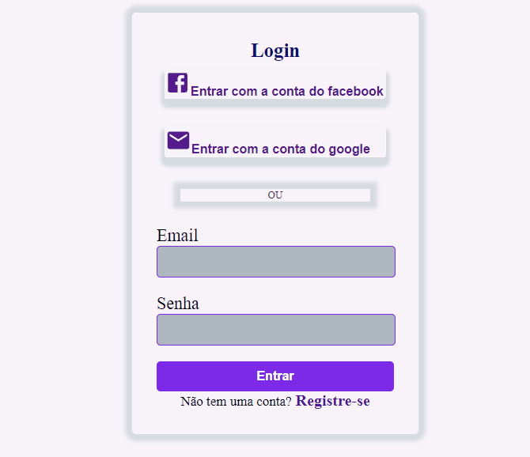

## Login screen with ReacJS

## Technology
- ReactJS -- JavaScript library for user interfaces
- Jsx -- Is a syntax that allows you to write HTML in JavaScript

### Dependency
- React-router-dom --A router allows your application to navigate between different components
- Styled-components -- allow writing CSS in JavaScript using Tagged Templates Literals
- Material-ui -- Is a  feacture that implement Google's Material Design.

### Getting started
1. Clone this repo usign git clone
2. Move yourself to the directory: cd loginapp
3. npm install dependencies
4. npm start for run in project

